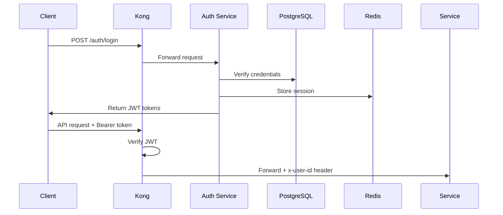

# LMS Microservices Platform

> Event-Driven Learning Management System built with Microservices Architecture

[](https://www.typescriptlang.org/)
[](https://nodejs.org/)
[](https://nextjs.org/)
[](LICENSE)

---

## 📖 Table of Contents

- [Overview](#overview)
- [Tech Stack](#tech-stack)
- [Architecture](#architecture)
- [Getting Started](#getting-started)
- [Project Structure](#project-structure)
- [Services](#services)
- [API Documentation](#api-documentation)
- [Development](#development)
- [Deployment](#deployment)

---

## 🎯 Overview

A production-ready Learning Management System (LMS) featuring:

- 📚 **Course Management** - Create, manage, and organize courses with curriculum builder
- 💳 **Payment Integration** - VNPay payment gateway for course enrollment
- 🔔 **Real-time Notifications** - Kafka-driven event system for notifications
- 📊 **Learning Progress** - Track student progress and completion
- 🎥 **Media Management** - Video hosting with presigned URLs (S3/VideoCipher)

---

## 🛠️ Tech Stack

### Frontend
- **Next.js 15** - React framework with App Router
- **Shadcn UI** - Component library
- **Server Actions** - BFF (Backend for Frontend) pattern
- **TailwindCSS** - Styling

### Backend
- **Node.js** - Runtime environment
- **Express** - HTTP framework
- **TypeScript** - Type safety
- **Prisma** - ORM for PostgreSQL

### Infrastructure
- **PostgreSQL** - Database (Neon Serverless)
- **Apache Kafka** - Event streaming
- **Redis** - Session & caching
- **Kong Gateway** - API Gateway
- **Docker** - Containerization
- **Turborepo** - Monorepo management

### Payments
- **VNPay** - Vietnam payment gateway

---

## 🏗️ Architecture

### Principles

✅ **Microservices** - Independent, deployable services  
✅ **Database per Service** - Each service owns its database  
✅ **Event-Driven** - Kafka for async communication  
✅ **BFF Pattern** - Next.js Server Actions aggregate data  
✅ **API Gateway** - Kong handles JWT & routing  

### Architecture Diagram

```
┌─────────────┐
│  Next.js 15 │ (Frontend + BFF)
│  Port 3000  │
└──────┬──────┘
       │
       ▼
┌─────────────┐
│ Kong Gateway│ (JWT, Rate Limit, CORS)
│  Port 8000  │
└──────┬──────┘
       │
       ├──────────────────────────┬──────────────────┬─────────────────┐
       ▼                          ▼                  ▼                 ▼
┌─────────────┐          ┌─────────────┐    ┌─────────────┐  ┌────────────┐
│Auth Service │          │Course Service│    │Payment Svc  │  │ Media Svc  │
│  Port 3001  │          │  Port 3002  │    │  Port 3003  │  │ Port 3004  │
└──────┬──────┘          └──────┬──────┘    └──────┬──────┘  └─────┬──────┘
       │                        │                   │                │
       ▼                        ▼                   ▼                ▼
 ┌──────────┐           ┌──────────┐        ┌──────────┐    ┌──────────┐
 │ auth_db  │           │course_db │        │payment_db│    │ media_db │
 └──────────┘           └──────────┘        └──────────┘    └──────────┘
    (Neon)                 (Neon)              (Neon)          (Neon)

                              │
                              ▼
                        ┌──────────┐
                        │  Kafka   │ (Event Bus)
                        └────┬─────┘
                             │
                     ┌───────┴────────┐
                     ▼                ▼
              ┌─────────────┐  ┌─────────────┐
              │Course Worker│  │Notification │
              │ (Consumer)  │  │Service 3005 │
              └─────────────┘  └─────────────┘
```

---

## 🚀 Getting Started

### Prerequisites

- **Node.js** >= 18.0
- **pnpm** >= 8.0
- **Docker** & Docker Compose
- **Neon Account** (for PostgreSQL databases)

### Installation

1. **Clone repository**
```bash
git clone <repository-url>
cd olms-microservices
```

2. **Install dependencies**
```bash
pnpm install
```

3. **Setup environment variables**

Each service needs its own `.env` file:

```bash
# Root (shared infrastructure)
cp .env.example .env

# Auth Service
cp services/auth-service/.env.example services/auth-service/.env
# Edit DATABASE_URL, REDIS_URL, JWT_SECRET
```

4. **Create Neon databases**

Visit [Neon.tech](https://neon.tech) and create 5 databases:
- `auth_db`
- `course_db`
- `payment_db`
- `media_db`
- `notification_db`

Copy connection strings to respective service `.env` files.

5. **Start infrastructure**
```bash
# Start Kafka, Zookeeper, Redis, Kong
docker-compose up -d

# Verify services
docker-compose ps
```

6. **Run database migrations**
```bash
cd services/auth-service
pnpm prisma:migrate
pnpm prisma:generate
```

7. **Start development**
```bash
# From root - starts all services
pnpm dev

# Or individual service
cd services/auth-service
pnpm dev
```

---

## 📁 Project Structure

```
olms-microservices/
├── apps/
│   └── web-client/              # Next.js 15 Frontend (Phase 4)
├── services/
│   ├── auth-service/            # Authentication & JWT ✅
│   ├── course-service/          # Course CRUD (Phase 5)
│   ├── payment-service/         # VNPay Integration (Phase 9-10)
│   ├── media-service/           # Media URLs (Phase 6)
│   └── notification-service/    # Email Worker (Phase 14)
├── packages/
│   ├── logger/                  # Pino logger ✅
│   ├── types/                   # Shared TypeScript types ✅
│   ├── db-prisma/              # Prisma singleton ✅
│   ├── kafka-client/           # Kafka producer/consumer
│   └── env-validator/          # Zod env validation ✅
├── docker-compose.yml          # Kafka, Redis, Kong ✅
├── kong.yml                    # Kong config ✅
└── turbo.json                  # Turborepo config ✅
```

---

## 🧩 Services

### Auth Service (✅ Phase 3)
**Port:** 3001  
**Database:** `auth_db`  

**Features:**
- User registration with bcrypt hashing
- JWT authentication (Access + Refresh tokens)
- Redis session storage
- Token refresh mechanism

**Endpoints:**
- `POST /register` - Create new user
- `POST /login` - Authenticate user
- `POST /refresh` - Refresh access token
- `POST /logout` - Invalidate session

[📘 API Docs](services/auth-service/README.md)

---

### Course Service (🚧 Phase 5)
**Port:** 3002  
**Database:** `course_db`  

**Features:**
- Course CRUD operations
- Curriculum builder
- Lesson management
- Enrollment tracking

---

### Payment Service (🚧 Phase 9-10)
**Port:** 3003  
**Database:** `payment_db`  

**Features:**
- VNPay integration
- Order management
- Transaction audit logs (JSONB)
- Kafka event publishing

---

### Media Service (🚧 Phase 6)
**Port:** 3004  
**Database:** `media_db`  

**Features:**
- Presigned URL generation (S3/VideoCipher)
- Media metadata storage

---

### Notification Service (🚧 Phase 14)
**Port:** 3005  
**Database:** `notification_db`  

**Features:**
- Email queue processing
- Kafka event consumption
- Notification history

---

## 📚 API Documentation

### Standard Response Format

All APIs return:

```typescript
interface ApiResponse<T> {
  success: boolean;
  code: number;
  message: string;
  data: T | null;
  trace_id: string;
}
```

### Authentication Flow



### Gateway Headers

Kong injects these headers to downstream services:

```
x-user-id: <user_id>
x-user-role: <student|instructor|admin>
x-trace-id: <uuid>
```

Services **MUST NOT** re-verify JWT. Trust gateway headers.

---

## 💻 Development

### Run Tests
```bash
pnpm test
```

### Lint Code
```bash
pnpm lint
```

### Build All Services
```bash
pnpm build
```

### Database Management
```bash
# Prisma Studio (GUI)
cd services/auth-service
pnpm prisma:studio

# Create migration
pnpm prisma migrate dev --name <migration_name>

# Reset database
pnpm prisma migrate reset
```

### Docker Commands
```bash
# View logs
docker-compose logs -f kafka

# Restart service
docker-compose restart redis

# Stop all
docker-compose down

# Clean volumes
docker-compose down -v
```

---

## 🚢 Deployment

### Environment Variables

**Production checklist:**
- [ ] Change `JWT_SECRET` to secure random string (min 32 chars)
- [ ] Update `DATABASE_URL` to production Neon instance
- [ ] Set `NODE_ENV=production`
- [ ] Configure `CORS_ORIGIN` to frontend domain
- [ ] Update VNPay credentials

### Build Docker Images
```bash
# Build all services
docker build -t lms-auth-service -f services/auth-service/Dockerfile .
```

### Health Checks

Each service exposes `/health` endpoint:
```bash
curl http://localhost:3001/health
```

---

## 🔒 Security

- ✅ JWT tokens with short expiry (15min access, 7d refresh)
- ✅ Bcrypt password hashing (10 rounds)
- ✅ Rate limiting (100 req/min via Kong)
- ✅ CORS configuration
- ✅ Helmet.js security headers
- ✅ Environment variable validation
- ✅ Database SSL connections (Neon)

---

## 📋 Project Roadmap

### ✅ Phase 1-3: Foundation (Completed)
- [x] Monorepo setup (Turborepo)
- [x] Docker Compose (Kafka, Redis, Kong)
- [x] API Gateway configuration
- [x] Shared packages (logger, types, db-prisma, env-validator)
- [x] Auth Service (JWT + Redis sessions)

### 🚧 Phase 4-9: Core Features (In Progress)
- [ ] Frontend base (Next.js 15 + Shadcn UI)
- [ ] Course Service (CRUD API)
- [ ] Media Service (Presigned URLs)
- [ ] Instructor UI (Curriculum builder)
- [ ] Public UI (Course listing)
- [ ] Payment Service (Orders & Audit)

### 📅 Phase 10-15: Commerce & Polish
- [ ] VNPay integration
- [ ] Kafka producer (payment events)
- [ ] Kafka consumer (enrollment logic + retry)
- [ ] Learning UI (Video player, progress)
- [ ] Notification Service (Email worker)
- [ ] Deployment & audit

---

## 🤝 Contributing

This is a learning project. Contributions are welcome!

1. Fork the repository
2. Create feature branch (`git checkout -b feature/amazing-feature`)
3. Commit changes (`git commit -m 'Add amazing feature'`)
4. Push to branch (`git push origin feature/amazing-feature`)
5. Open Pull Request

---

## 📄 License

This project is licensed under the MIT License.

---

## 🙏 Acknowledgments

- [Neon](https://neon.tech) - Serverless PostgreSQL
- [Kong Gateway](https://konghq.com) - API Gateway
- [Prisma](https://prisma.io) - Database ORM
- [Next.js](https://nextjs.org) - React framework
- [Turborepo](https://turbo.build) - Monorepo tool

---

## 📞 Support

For issues and questions:
- Create an [Issue](https://github.com/your-repo/issues)
- Email: support@example.com

---

**Built with ❤️ using TypeScript & Microservices**
