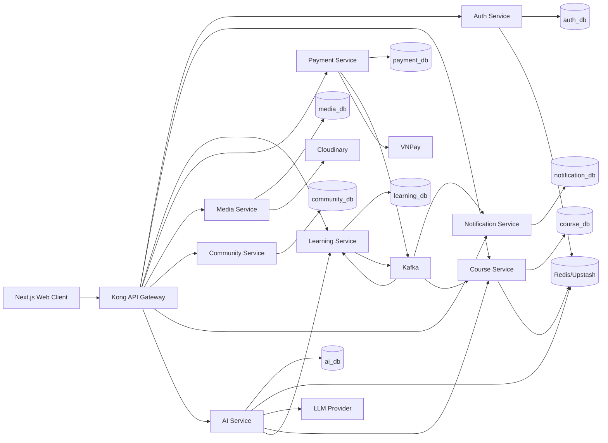

# LMS Microservices Platform

## Overview

LMS Microservices Platform là nền tảng học trực tuyến được xây dựng theo kiến trúc microservices và event-driven. Hệ thống hỗ trợ ba nhóm người dùng chính: học viên, giảng viên và quản trị viên, với các luồng nghiệp vụ xoay quanh khóa học, thanh toán, học tập, chứng chỉ, cộng đồng và trợ lý AI.

Dự án sử dụng Next.js App Router làm web client kiêm BFF thông qua Server Actions, Kong Gateway làm entry point và security boundary, các backend service Node.js/TypeScript độc lập, PostgreSQL Neon Serverless theo mô hình database per service, Kafka cho luồng bất đồng bộ, Redis/Upstash cho cache/rate limit/read model, Cloudinary cho media và VNPay cho thanh toán.

Trọng tâm kỹ thuật của hệ thống là tách rõ boundary giữa các service, không truy cập chéo database, chuẩn hóa response API, xử lý payment an toàn, enrollment idempotent, retry/DLQ cho Kafka, transactional outbox cho sự kiện quan trọng và tích hợp AI vào workflow học tập bằng context của khóa học/bài học.

## Table of Contents

- [Overview](#overview)
- [Screenshots](#screenshots)
- [Product Scope](#product-scope)
- [Technical Highlights](#technical-highlights)
- [Features](#features)
- [Tech Stack](#tech-stack)
- [Architecture](#architecture)
- [Services](#services)
- [Service Boundary Details](#service-boundary-details)
- [Key Workflows](#key-workflows)
- [Reliability, Security and Operations](#reliability-security-and-operations)
- [Project Structure](#project-structure)
- [Getting Started](#getting-started)
- [API Convention](#api-convention)
- [Development Commands](#development-commands)
- [Testing and Demo Data](#testing-and-demo-data)
- [Deployment Notes](#deployment-notes)

## Screenshots

### Landing Page
<!-- TODO: Paste landing page screenshot here -->

### Authentication
<!-- TODO: Paste authentication screenshot here -->

### Course Discovery
<!-- TODO: Paste course discovery screenshot here -->

### Course Detail
<!-- TODO: Paste course detail screenshot here -->

### Student Dashboard
<!-- TODO: Paste student dashboard screenshot here -->

### Learning Page
<!-- TODO: Paste learning page screenshot here -->

### Instructor Studio
<!-- TODO: Paste instructor studio screenshot here -->

### Admin Dashboard
<!-- TODO: Paste admin dashboard screenshot here -->

### Payment Flow
<!-- TODO: Paste payment flow screenshot here -->

### Community and Q&A
<!-- TODO: Paste community/Q&A screenshot here -->

### AI Chat and Quiz
<!-- TODO: Paste AI features screenshot here -->

## Product Scope

Hệ thống không chỉ dừng ở CRUD khóa học. Repository này mô phỏng một nền tảng LMS đầy đủ với nhiều vai trò, nhiều service backend và các workflow có trạng thái dài như thanh toán, ghi danh, học tập, chứng chỉ, doanh thu, hỗ trợ người dùng và AI học tập.

| Role | Main Capabilities |
|---|---|
| Guest | Xem landing page, danh sách khóa học, chi tiết khóa học, giảng viên và đánh giá public |
| Student | Đăng ký/đăng nhập, ghi danh khóa học, thanh toán, học bài, theo dõi tiến độ, nhận chứng chỉ, đặt câu hỏi, dùng AI chat/quiz |
| Instructor | Tạo khóa học, quản lý curriculum, upload media, quản lý hồ sơ giảng viên, theo dõi Q&A, xem earning và gửi payout request |
| Admin | Quản trị user, khóa học, danh mục, review, support ticket, community, order, revenue, payout, notification, audit log và DLQ |

Phạm vi nghiệp vụ chính:

- Course catalog: course, category, level, price, thumbnail, public detail, search/filter/sort.
- Curriculum: chapter, lesson, video/text content, free/paid lesson gate, publish guard.
- Learning: enrollment, progress, complete lesson, certificate, dashboard.
- Commerce: order, VNPay, return/IPN, audit, outbox, event sourcing, order history.
- Revenue: instructor earning, payout profile, payout request và admin payout handling.
- Community: global feed, reply, reaction, moderation.
- Q&A: question/answer theo khóa học, upvote, accepted answer và instructor workflow.
- Notification: in-app notification, unread state, admin notification history, SMTP-ready email log.
- AI: conversation, lesson/course context, quiz generation, quiz submission, provider fallback và rate limit.
- Operations: health/readiness, Kafka retry/DLQ, seed data, smoke/rate-limit tests, production compose.

## Technical Highlights

### Microservices and Ownership

- Mỗi service có boundary riêng, database riêng và Prisma schema riêng.
- Không có cross-service database join; dữ liệu liên service đi qua internal API hoặc Kafka.
- Service ownership rõ ràng: auth không quản lý course, payment không tự ghi enrollment, community không đọc trực tiếp user/course database.
- Các service dùng chung contract và utility qua `packages/*` để tránh copy logic.

### BFF with Server Actions

- Web client dùng Next.js App Router và Server Actions làm Backend-for-Frontend.
- Server Actions gọi API qua Kong Gateway, xử lý cookie/token, refresh token và trả dữ liệu phù hợp cho page/component.
- UI không gọi trực tiếp database và không gom business logic của service vào frontend.
- Dashboard và các trang tổng hợp có thể lấy dữ liệu song song từ nhiều service thay vì buộc backend join chéo.

### Event-Driven Reliability

- Kafka được dùng cho các workflow bất đồng bộ như payment completed, enrollment created, notification và course read model.
- `packages/kafka-client` có typed event envelope, Zod validation, retry policy và DLQ handoff.
- Retry chain cho `payment.order.completed` gồm main topic, retry 5 giây, retry 30 giây, retry 1 phút và `system.dead-letter`.
- Offset Kafka chỉ được commit sau khi handler xử lý xong hoặc event đã được bàn giao sang retry/DLQ.

### Transactional Outbox

- payment-service không publish Kafka trực tiếp trong transaction thanh toán; service ghi outbox event trước.
- Outbox worker publish event sau, có retry/backoff và trạng thái `PENDING`, `PROCESSING`, `PUBLISHED`, `FAILED`.
- learning-service cũng có outbox cho `learning.enrollment.created`.
- Cách này giảm rủi ro mất event khi database đã commit nhưng Kafka tạm thời lỗi.

### Payment Safety

- payment-service xác minh course và price từ course-service internal API trước khi tạo order.
- Client không được quyết định số tiền thanh toán.
- VNPay return và IPN đều được verify checksum.
- Payload callback VNPay được lưu vào JSONB audit để giữ dữ liệu đối soát.
- Order completion được xử lý idempotently để tránh callback lặp tạo nhiều enrollment hoặc nhiều event.

### CQRS-style Course Discovery

- course-service có Redis read store cho course discovery khi cache/read model khả dụng.
- API có fallback Prisma để hệ thống vẫn chạy khi Redis không sẵn sàng.
- Có script warmup read model từ dữ liệu hiện có.
- Course catalog event giúp đồng bộ read model mà không ép mọi request public phải query toàn bộ relational schema.

### AI in Learning Flow

- AI không hoạt động như chatbot rời rạc; nó lấy context từ khóa học, chương, bài học, transcript hoặc auto context.
- ai-service kiểm tra quyền học tập qua learning-service trước các luồng cần enrollment/completion.
- Conversation, message và quiz session được lưu riêng trong `ai_db`.
- Provider fallback giúp đổi hoặc sắp thứ tự provider mà không đổi contract frontend.
- Rate limit AI dùng Redis khi có cấu hình, fallback in-memory cho local development.

### Admin and Governance

- Admin có các màn hình vận hành thực tế: users, courses, categories, reviews, orders, revenue, payouts, support, notifications, community, audit log và DLQ.
- Các thao tác nhạy cảm có audit trail ở auth-service hoặc service sở hữu nghiệp vụ.
- Payout flow có role guard, trạng thái xử lý và liên kết với earning.
- DLQ UI/API cho phép kiểm tra failed event, retry thủ công và resolve thay vì bỏ lỗi trong log.

## Features

### Authentication and User Management

- Đăng ký, đăng nhập, đăng xuất và refresh token rotation.
- Quản lý access token, refresh token, session Redis và cleanup token hết hạn.
- Phân quyền theo role học viên, giảng viên và quản trị viên.
- Luồng đăng ký giảng viên qua instructor request, admin review và audit log.
- Quản trị người dùng, trạng thái tài khoản, đổi role, đổi mật khẩu và cấu hình hệ thống.
- Hệ thống support ticket cho người dùng và admin xử lý phản hồi.

### Course Management

- Quản lý khóa học, chương, bài học, danh mục, cấp độ, giá bán và trạng thái xuất bản.
- Instructor Studio cho tạo khóa học, chỉnh curriculum, upload thumbnail, cấu hình bài học miễn phí/trả phí.
- Hỗ trợ lesson video upload, YouTube/external media và nội dung text theo bài học.
- Course discovery với search, filter, sort, pagination và Redis read model khi được bật.
- Rating/review sau khi học viên hoàn thành khóa học theo điều kiện nghiệp vụ.
- Hồ sơ giảng viên public, danh sách khóa học theo giảng viên và certificate template.

### Learning Experience

- Ghi danh khóa miễn phí hoặc khóa đã thanh toán.
- Theo dõi tiến độ bài học, trạng thái hoàn thành và phần trăm hoàn thành khóa học.
- Trang học tập riêng cho từng khóa, video player, navigation bài học và Q&A trong ngữ cảnh học.
- Cấp chứng chỉ khi học viên hoàn thành điều kiện khóa học.
- Dashboard học viên gồm khóa học của tôi, chứng chỉ, đơn hàng, cộng đồng và các trạng thái liên quan.

### Payment and Revenue

- Tạo order thanh toán khóa học qua VNPay.
- Payment service xác minh giá khóa học từ course-service, không tin giá từ client.
- Xác thực checksum VNPay cho return callback và IPN.
- Lưu payload VNPay vào JSONB để phục vụ audit và đối soát.
- Order event sourcing với lịch sử sự kiện đơn hàng cho admin.
- Transactional outbox cho `payment.order.completed`.
- Theo dõi doanh thu, instructor earning, payout profile và payout request.

### Event-Driven Enrollment

- Kafka event `payment.order.completed` kích hoạt enrollment trong learning-service.
- Enrollment idempotent theo order/course/user để tránh ghi danh trùng.
- learning-service phát `learning.enrollment.created` để các service khác cập nhật read model hoặc thông báo.
- Retry chain cho payment event: main topic, retry 5 giây, retry 30 giây, retry 1 phút, sau đó DLQ.
- Admin DLQ có thống kê, danh sách failed event, retry thủ công và resolve.

### Media Upload

- Media service tách riêng với database và storage abstraction.
- Cloudinary là provider chính khi cấu hình `CLOUDINARY_URL`.
- Local storage fallback cho development/test và khi Cloudinary không khả dụng.
- Presigned/direct upload flow, confirm upload, external media registration và media lookup theo lesson/course.
- Giữ provider abstraction để có thể thay đổi storage backend mà không đổi controller chính.

### Notifications

- In-app notification cho người dùng.
- Notification bell trong web client với unread count, mark as read và mark all as read.
- Notification service consume Kafka event từ payment/enrollment flow.
- Lưu lịch sử notification và hỗ trợ SMTP email khi cấu hình.
- Admin có thể xem lịch sử notification.

### Community and Q&A

- Community feed toàn hệ thống cho người dùng đã đăng nhập.
- Tạo bài viết, trả lời, reaction, chỉnh sửa và xóa theo quyền.
- Q&A theo khóa học với question, answer, upvote và accepted answer.
- Instructor theo dõi câu hỏi liên quan đến khóa học của mình.
- Community service gọi internal API để lấy thông tin người dùng/khóa học mà không truy cập chéo database.

### AI Features

- AI chatbot theo course/lesson context.
- Quản lý conversation, message history và xóa conversation.
- AI quiz theo bài học/khóa học, submit quiz và lưu lịch sử.
- Context loader lấy dữ liệu khóa học, bài học, transcript hoặc auto context từ course-service.
- Kiểm tra enrollment/completion qua learning-service trước các luồng AI cần quyền học tập.
- Provider fallback theo cấu hình như OpenRouter, Groq, DeepSeek hoặc provider tương thích OpenAI API.
- Rate limit AI bằng Redis/Upstash nếu cấu hình, có fallback in-memory cho development.

### Admin Operations

- Admin dashboard cho user, course, category, review, community, support, revenue, payout, order và notification.
- Audit log cho các thao tác nhạy cảm.
- System config có validation và default.
- DLQ monitor cho event lỗi và thao tác retry/resolve.
- Health endpoints `/health`, `/livez`, `/readyz` cho các service.

## Tech Stack

| Layer | Technology | Purpose |
|---|---|---|
| Language | TypeScript | Ngôn ngữ chính cho frontend, backend và shared packages |
| Monorepo | pnpm workspace, Turborepo | Quản lý nhiều app/service/package trong một repository |
| Web Client | Next.js App Router, React | Giao diện học viên, giảng viên, admin và BFF layer |
| UI | Tailwind CSS, Shadcn UI, Radix UI, Lucide React | Component, layout, form và icon |
| BFF | Next.js Server Actions | Gọi nhiều microservice qua Gateway và tổng hợp dữ liệu cho UI |
| Backend | Node.js, Express | HTTP API cho các service độc lập |
| API Gateway | Kong Gateway DB-less | Routing, CORS, JWT boundary, rate limit và trace header |
| Database | PostgreSQL Neon Serverless | Database per service với kết nối SSL |
| ORM | Prisma ORM | Schema, migration và type-safe database access |
| Messaging | Apache Kafka | Event-driven workflow, retry topic và dead-letter topic |
| Cache | Upstash Redis / Redis Cloud | Session/cache/read model/rate limit tùy service |
| Payment | VNPay | Tạo payment URL, return callback, IPN và checksum verification |
| Media | Cloudinary, local fallback | Upload và phân phối media cho khóa học/bài học |
| Notification | In-app notification, SMTP/Nodemailer | Thông báo trong app và email khi cấu hình |
| AI Provider | OpenRouter, Groq, DeepSeek hoặc provider tương thích | Chatbot và quiz dựa trên course/lesson context |
| DevOps | Docker Compose, production compose override, deploy script | Local infrastructure và triển khai production-like |
| Shared Packages | `packages/*` | Types, logger, env validator, Prisma helper, cache và Kafka client |

## Architecture

Hệ thống dùng microservices architecture với database per service. Mỗi service sở hữu database riêng và không truy cập database của service khác. Khi cần dữ liệu liên service, hệ thống dùng HTTP internal API qua `/internal/*` với `x-internal-secret` hoặc dùng Kafka event.

Kong Gateway là entry point cho client. Gateway xử lý route, CORS, rate limit, xác thực JWT và inject các header như `x-user-id`, `x-user-role`, `x-user-email`, `x-trace-id` cho downstream service. Các service tin Gateway header thay vì tự verify JWT lại.

Next.js Server Actions đóng vai trò BFF. Web client gọi Gateway, tổng hợp dữ liệu từ nhiều service và trả dữ liệu đã chuẩn hóa cho page/component. Kafka được dùng cho các workflow bất đồng bộ như thanh toán thành công, tạo enrollment, notification, cập nhật read model và DLQ.


```mermaid
flowchart LR
  Web[Next.js Web Client] --> Gateway[Kong API Gateway]

  Gateway --> Auth[Auth Service]
  Gateway --> Course[Course Service]
  Gateway --> Learning[Learning Service]
  Gateway --> Payment[Payment Service]
  Gateway --> Media[Media Service]
  Gateway --> Community[Community Service]
  Gateway --> Notification[Notification Service]
  Gateway --> AI[AI Service]

  Auth --> AuthDB[(auth_db)]
  Course --> CourseDB[(course_db)]
  Learning --> LearningDB[(learning_db)]
  Payment --> PaymentDB[(payment_db)]
  Media --> MediaDB[(media_db)]
  Community --> CommunityDB[(community_db)]
  Notification --> NotificationDB[(notification_db)]
  AI --> AIDB[(ai_db)]

  Course --> Redis[(Redis/Upstash)]
  AI --> Redis
  Auth --> Redis

  Payment --> Kafka[Kafka]
  Kafka --> Learning
  Kafka --> Notification
  Learning --> Kafka
  Kafka --> Course

  Media --> Cloudinary[Cloudinary]
  Payment --> VNPay[VNPay]

  AI --> AIProvider[LLM Provider]
  AI --> Course
  AI --> Learning
```

## Services

| Service | Default Port | Database | Main Responsibility |
|---|---:|---|---|
| `auth-service` | 3101 | `auth_db` | Authentication, user, role, instructor request, audit log, support ticket, system config |
| `course-service` | 3002 | `course_db` | Course, chapter, lesson, category, review, instructor profile, transcript/context, course discovery |
| `learning-service` | 3006 | `learning_db` | Enrollment, lesson progress, certificate, failed event, learning outbox, DLQ |
| `community-service` | 3007 | `community_db` | Community feed, course Q&A, answers, upvotes, moderation actions |
| `payment-service` | 3003 | `payment_db` | VNPay order, audit, order event sourcing, payment outbox, earning, payout |
| `media-service` | 3004 | `media_db` | Media asset, upload request, Cloudinary/local storage provider, external media |
| `notification-service` | 3005 | `notification_db` | In-app notification, Kafka notification consumer, SMTP/email history |
| `ai-service` | 3008 | `ai_db` | AI conversation, chat message, quiz session, course/lesson AI context |

## Service Boundary Details

### auth-service

auth-service là identity and governance service của hệ thống. Service này chịu trách nhiệm với user account, credential, role, token, instructor request, audit log, system config và support ticket.

Điểm đáng chú ý:

- Register mặc định tạo user role học viên, tránh client tự gửi role đặc quyền.
- Become instructor đi qua request/review flow thay vì tự nâng quyền trực tiếp.
- Admin-only endpoints quản lý user role/status/password và instructor request.
- Refresh token rotation và cleanup job giúp giảm rủi ro token cũ tồn tại lâu.
- Audit log tách khỏi business service để ghi nhận thao tác nhạy cảm từ nhiều nơi.
- Internal API cung cấp user/admin/instructor lookup cho service khác mà không chia sẻ database.

### course-service

course-service sở hữu course catalog và curriculum. Đây là service trung tâm cho dữ liệu khóa học public, dữ liệu instructor và context phục vụ AI.

Điểm đáng chú ý:

- Course, chapter, lesson, category, review, instructor profile và certificate template nằm trong cùng boundary học liệu.
- Public course discovery hỗ trợ search/filter/sort/pagination.
- Instructor APIs quản lý course lifecycle, publish guard, chapter/lesson ordering và certificate template.
- Review có điều kiện nghiệp vụ, gắn với course và user.
- Lesson transcript/context phục vụ AI chat/quiz, có manual/subtitle/auto context flow.
- Redis read model giúp tối ưu course listing, có fallback Prisma khi cache unavailable.
- Consumer `learning.enrollment.created` cập nhật enrollment signal/read model mà không đọc learning database.

### learning-service

learning-service sở hữu trạng thái học tập của học viên. Service này tách khỏi course-service để course catalog không bị trộn với enrollment/progress.

Điểm đáng chú ý:

- Enrollment idempotent cho cả khóa miễn phí và khóa thanh toán.
- Lesson progress dùng upsert để cập nhật trạng thái xem bài và hoàn thành bài.
- Certificate được phát hành dựa trên completion state.
- Internal API cho ai-service/payment-related flow kiểm tra enrollment và completion.
- Kafka consumer xử lý `payment.order.completed` và tạo enrollment.
- Failed event/DLQ được persist vào `learning_db` để admin retry/resolve.
- Learning outbox phát `learning.enrollment.created` cho notification/course read model.

### payment-service

payment-service sở hữu toàn bộ commerce boundary: order, VNPay, audit, outbox, event history, earning và payout.

Điểm đáng chú ý:

- Order creation gọi course-service để xác minh course price, chống price tampering từ client.
- VNPay helper chuẩn hóa tham số, tạo pay URL và verify callback checksum.
- Return callback và IPN dùng chung logic hoàn tất order idempotent.
- VNPayAudit lưu callback payload JSONB để đối soát.
- OrderEvent lưu event history; admin có thể xem timeline đơn hàng và folded current state.
- Transactional outbox đảm bảo payment completed event không mất khi Kafka lỗi.
- Circuit breaker/timeout cho internal call đến course-service giúp cô lập lỗi phụ thuộc.
- Instructor earning và payout có guard, status workflow và audit.

### media-service

media-service tách media upload/delivery khỏi course-service để course chỉ lưu URL/metadata cần thiết.

Điểm đáng chú ý:

- Storage abstraction cho Cloudinary, S3-compatible implementation và local fallback.
- Cloudinary được ưu tiên khi có `CLOUDINARY_URL`.
- Local upload/download route phục vụ dev/test và fallback khi provider chính gặp lỗi.
- Upload flow gồm request upload URL, browser upload, confirm upload và lookup media.
- Hỗ trợ external media để đăng ký video YouTube hoặc URL đã có.
- Media lookup theo lesson/course giúp web client gắn tài nguyên vào bài học.

### notification-service

notification-service sở hữu notification state và email delivery log. Service này không quyết định nghiệp vụ payment/enrollment, chỉ phản ứng theo event hoặc internal command.

Điểm đáng chú ý:

- Consume `payment.order.completed` và `learning.enrollment.created`.
- Tạo in-app notification idempotent theo event.
- API cho user list notification, mark as read và mark all as read.
- Admin API xem lịch sử notification.
- SMTP/Nodemailer được cấu hình qua environment, phù hợp local hoặc production-like.
- Internal notification endpoint cho service khác gửi thông báo mà không cần truy cập DB.

### community-service

community-service tách social interaction khỏi course-service. Service này xử lý feed toàn hệ thống và Q&A theo khóa học.

Điểm đáng chú ý:

- CommunityPost hỗ trợ post, reply/comment, reaction, edit và delete.
- Q&A hỗ trợ question, answer, upvote và accepted answer.
- Q&A có route theo course và route instructor để giảng viên theo dõi câu hỏi liên quan.
- Service gọi auth-service/course-service qua internal client để enrich tên người dùng và thông tin khóa học.
- Không lưu trùng toàn bộ dữ liệu user/course ngoài các khóa tham chiếu cần thiết.

### ai-service

ai-service sở hữu AI conversation và quiz session. Service này phụ thuộc vào course/learning context qua internal API thay vì tự lưu bản sao học liệu đầy đủ.

Điểm đáng chú ý:

- Chat conversation CRUD và message history.
- Quiz generation, submit, history và status theo lesson/course.
- Access control dựa trên enrollment/completion từ learning-service.
- Course/lesson context lấy từ course-service và được rút gọn trước khi gửi provider.
- Provider fallback theo `AI_PROVIDER_ORDER`.
- Rate limit có Redis backend và in-memory fallback.
- Input guard và quiz quality validation giúp giảm response kém chất lượng từ LLM.

### web-client

web-client là giao diện chính và BFF layer. App không chỉ render UI mà còn gom dữ liệu từ nhiều service bằng Server Actions.

Điểm đáng chú ý:

- App Router chia route theo public, dashboard, learn, instructor và admin.
- Server Actions tách theo domain: auth, discovery, learning, payment, notification, community, Q&A, AI, admin, support.
- API client xử lý access token, refresh token, cookie và fallback khi session stale.
- Shared UI components cho navbar, notification bell, course cards, dashboard panels và learning UI.
- Admin/Instructor shell tách riêng workflow để người dùng thao tác theo vai trò.

### Shared Packages

Các package dùng chung giúp microservices giữ contract nhất quán mà không copy/paste logic.

| Package | Responsibility |
|---|---|
| `@lms/types` | `ApiResponse<T>`, response helpers, auth middleware factories và shared type contracts |
| `@lms/logger` | Structured logger dùng chung cho service logs |
| `@lms/env-validator` | Zod-based environment validation cho service runtime |
| `@lms/db-prisma` | Prisma helper và retry wrapper cho lỗi kết nối/cold start |
| `@lms/kafka-client` | Kafka producer/consumer, typed envelope, Zod event validation, retry policy và DLQ |
| `@lms/cache` | Redis/cache abstraction dùng cho read model, rate limit hoặc cache theo service |

## Key Workflows

### Authentication Boundary

1. Web client gửi login/register/refresh qua Kong route `/auth`.
2. auth-service xử lý credential, token và session.
3. Request protected đi qua Kong JWT plugin.
4. Kong inject `x-user-id`, `x-user-role`, `x-user-email`.
5. Service downstream dùng header này để authorize theo role và ownership.

### Payment to Enrollment

1. Học viên tạo order qua payment-service.
2. payment-service gọi course-service internal API để xác minh khóa học và giá.
3. payment-service tạo order và VNPay payment URL.
4. VNPay redirect return hoặc gọi IPN.
5. payment-service verify checksum, lưu audit JSONB, hoàn tất order idempotently.
6. payment-service ghi outbox event `payment.order.completed`.
7. Outbox worker publish Kafka event.
8. learning-service consume event, tạo enrollment idempotently và ghi outbox `learning.enrollment.created`.
9. notification-service gửi notification; course-service cập nhật enrollment signal/read model khi nhận event liên quan.
10. Nếu handler lỗi, event đi qua retry topics rồi vào `system.dead-letter`.

### Course Discovery Read Model

1. course-service quản lý dữ liệu course/category/review trong `course_db`.
2. Khi Redis read model khả dụng, course discovery ưu tiên read store để search/filter/sort nhanh hơn.
3. Khi Redis không khả dụng, API fallback về Prisma query trực tiếp.
4. Script warmup có thể rebuild read model từ dữ liệu hiện có.

### AI Chat and Quiz

1. Web client gọi ai-service qua Kong route `/ai`.
2. ai-service kiểm tra quyền học tập qua learning-service khi cần.
3. ai-service lấy context khóa học/bài học từ course-service internal API.
4. Provider AI được gọi theo thứ tự cấu hình.
5. Conversation, message và quiz session được lưu trong `ai_db`.
6. Rate limit dùng Redis/Upstash nếu cấu hình, fallback in-memory cho development.

## Reliability, Security and Operations

### Data Consistency

Hệ thống có nhiều workflow bất đồng bộ, vì vậy consistency được xử lý bằng các cơ chế rõ ràng thay vì dựa vào side effect không kiểm soát.

- Database per service giúp tránh coupling schema giữa các domain.
- Internal API dùng cho read/validation tức thời như price verification hoặc enrollment check.
- Kafka dùng cho event propagation sau khi business state đã thay đổi.
- Transactional outbox đảm bảo event business-critical được persist trước khi publish.
- Idempotency được áp dụng ở payment completion, enrollment creation, notification và earning để chịu được callback/event lặp.
- Prisma transaction được dùng cho các luồng multi-write như order completion, payout và enrollment.
- JSONB audit giữ lại payload gateway/payment callback đầy đủ để debug và đối soát.

### Fault Tolerance

- Kong có timeout và rate limit ở gateway layer.
- payment-service có internal HTTP timeout và circuit breaker khi phụ thuộc course-service.
- Prisma helper có retry cho lỗi kết nối/cold start phù hợp với Neon Serverless.
- Outbox worker có retry/backoff khi Kafka producer hoặc broker lỗi.
- Kafka consumer wrapper hỗ trợ retry topics và DLQ thay vì mất message hoặc retry vô hạn không quan sát được.
- Read model Redis có fallback về Prisma query để course listing không phụ thuộc tuyệt đối vào cache.
- Media upload có local fallback khi Cloudinary không khởi tạo hoặc gặp lỗi runtime trong môi trường dev/test.

### Security Controls

- Kong là JWT verification boundary cho client traffic.
- Downstream service chỉ trust Gateway headers sau khi request đã đi qua Gateway route.
- Protected routes kiểm tra `x-user-id` và `x-user-role` theo role/ownership.
- Internal API yêu cầu `x-internal-secret`, tách khỏi public Gateway contract.
- Zod validation được dùng ở controller, env validator và Kafka payload.
- Payment không tin price từ client; payment-service lấy giá từ course-service.
- VNPay callback bắt buộc verify checksum trước khi hoàn tất order.
- Admin actions và payout/payment-sensitive actions được audit.
- Env examples chỉ chứa placeholder; secret thật nằm ngoài repository.

### Observability and Debugging

- API response có `trace_id` để liên kết request với log.
- Kong correlation-id plugin tạo hoặc echo `x-trace-id`.
- Shared logger giúp log có format nhất quán giữa service.
- Health endpoints `/health`, `/livez`, `/readyz` có ở backend services.
- DLQ admin API/UI giúp quan sát failed event thay vì chỉ đọc log.
- Order event history giúp debug vòng đời order theo timeline.
- Seed scripts tạo dữ liệu có chủ đích cho demo payment, DLQ, notification, support, Q&A và certificate.

### Operations Readiness

- Root scripts chuẩn hóa setup: install, Docker infrastructure, database migrate/generate và seed.
- Docker Compose local chỉ chạy hạ tầng cần thiết như Kafka, Zookeeper và Kong; database dùng Neon, Redis dùng Upstash/cloud.
- Production compose override có healthcheck cho backend services.
- Script deploy/render Kong production tách khỏi code application.
- K6 scripts kiểm tra smoke flow và rate-limit behavior.
- Prisma migrate deploy được gom theo workspace để giảm thao tác thủ công.

## Project Structure

```text
olms-microservices/
|-- apps/
|   `-- web-client/                 # Next.js App Router web client
|-- services/
|   |-- auth-service/               # Auth, user, role, audit, support
|   |-- course-service/             # Course catalog, curriculum, reviews, transcripts
|   |-- learning-service/           # Enrollment, progress, certificates, DLQ
|   |-- community-service/          # Feed and Q&A
|   |-- payment-service/            # VNPay, order, outbox, earning, payout
|   |-- media-service/              # Upload and media provider abstraction
|   |-- notification-service/       # In-app and email notification
|   `-- ai-service/                 # AI chat and quiz
|-- packages/
|   |-- cache/
|   |-- db-prisma/
|   |-- env-validator/
|   |-- kafka-client/
|   |-- logger/
|   `-- types/
|-- scripts/
|-- docker-compose.yml
|-- docker-compose.production.yml
|-- kong.yml
|-- package.json
|-- pnpm-workspace.yaml
`-- turbo.json
```

## Getting Started

### Prerequisites

- Node.js 18 trở lên.
- pnpm 8 trở lên.
- Docker và Docker Compose.
- PostgreSQL Neon databases cho từng service.
- Redis/Upstash URL nếu bật session/cache/rate limit/read model.
- Cloudinary account nếu dùng upload media production-like.
- VNPay sandbox/production credentials nếu test thanh toán.
- AI provider API key nếu dùng chatbot/quiz bằng LLM thật.

### Environment Setup

Repository có sẵn các file `.env.example` ở root, web client và từng service. Không commit `.env` thật.

```bash
cp .env.example .env
cp apps/web-client/.env.example apps/web-client/.env.local
cp services/auth-service/.env.example services/auth-service/.env
cp services/course-service/.env.example services/course-service/.env
cp services/learning-service/.env.example services/learning-service/.env
cp services/community-service/.env.example services/community-service/.env
cp services/payment-service/.env.example services/payment-service/.env
cp services/media-service/.env.example services/media-service/.env
cp services/notification-service/.env.example services/notification-service/.env
cp services/ai-service/.env.example services/ai-service/.env
```

Các nhóm biến quan trọng:

- `DATABASE_URL` và `DIRECT_URL` cho từng service.
- `INTERNAL_SERVICE_SECRET` dùng chung cho internal API.
- `KAFKA_BROKER` cho Kafka.
- `REDIS_URL` hoặc `CACHE_REDIS_URL` cho Redis/Upstash.
- `JWT_SECRET` hoặc secret tương ứng giữa auth-service và Kong config.
- `CLOUDINARY_URL` hoặc `STORAGE_PROVIDER=local` cho media-service.
- `VNPAY_TMN_CODE`, `VNPAY_HASH_SECRET`, `VNPAY_RETURN_URL`, `VNPAY_IPN_URL` cho payment-service.
- `AI_PROVIDER_ORDER` và API key/model của provider AI cho ai-service.

### Local Setup

```bash
pnpm install
pnpm docker:up
pnpm setup:db
pnpm seed
pnpm dev:web
```

Lệnh `pnpm setup` có thể dùng cho lần thiết lập đầu tiên nếu muốn gom install, Docker, database setup và seed:

```bash
pnpm setup
```

### Local Endpoints

| Component | URL |
|---|---|
| Web Client | `http://localhost:3000` |
| Kong Gateway | `http://localhost:8000` |
| Kong Admin API | `http://localhost:8001` |
| Auth Service | `http://localhost:3101/health` |
| Course Service | `http://localhost:3002/health` |
| Learning Service | `http://localhost:3006/health` |
| Community Service | `http://localhost:3007/health` |
| Payment Service | `http://localhost:3003/health` |
| Media Service | `http://localhost:3004/health` |
| Notification Service | `http://localhost:3005/health` |
| AI Service | `http://localhost:3008/health` |

## API Convention

Tất cả API trả về response envelope thống nhất:

```ts
interface ApiResponse<T> {
  success: boolean;
  code: number;
  message: string;
  data: T | null;
  trace_id: string;
}
```

Ví dụ response thành công:

```json
{
  "success": true,
  "code": 200,
  "message": "OK",
  "data": {
    "id": "resource-id"
  },
  "trace_id": "request-trace-id"
}
```

Ví dụ response lỗi:

```json
{
  "success": false,
  "code": 400,
  "message": "Invalid input",
  "data": null,
  "trace_id": "request-trace-id"
}
```

Gateway routes chính:

| Public Prefix | Downstream Service |
|---|---|
| `/auth` | auth-service |
| `/course` | course-service |
| `/learning` | learning-service |
| `/community` | community-service |
| `/qa` | community-service |
| `/payment` | payment-service |
| `/media` | media-service |
| `/notification` | notification-service |
| `/ai` | ai-service |

Internal service-to-service endpoints dùng `/internal/*` và header `x-internal-secret`. Các endpoint này không dành cho client public.

## Development Commands

```bash
# Install dependencies
pnpm install

# Start Kafka, Zookeeper and Kong
pnpm docker:up

# Stop local infrastructure
pnpm docker:down

# Check Docker containers
pnpm docker:health

# Build shared packages
pnpm build:shared

# Run web-focused local development stack
pnpm dev:web

# Run lighter web stack
pnpm dev:web:lite

# Build all workspaces
pnpm build

# Run tests
pnpm test

# Run lint
pnpm lint

# Generate Prisma clients for all services
pnpm prisma:generate:all

# Deploy pending migrations for all services
pnpm prisma:migrate:deploy:all

# Check migration status for all services
pnpm prisma:migrate:status:all

# Seed demo data
pnpm seed

# Seed DLQ demo data
pnpm seed:dlq-demo
```

## Testing and Demo Data

Repository có test và seed theo hướng phục vụ cả phát triển lẫn demo kiến trúc.

### Automated Checks

| Scope | Files / Commands | Purpose |
|---|---|---|
| Workspace build | `pnpm build` | Build tất cả app/service/package theo Turborepo |
| Unit/service tests | `pnpm test` | Chạy Vitest ở các workspace có test |
| Integration smoke | `tests/integration/phase-smoke.test.ts` | Kiểm tra contract/flow tích hợp mức cơ bản |
| K6 smoke | `tests/k6/smoke.js` | Smoke test qua Gateway/API |
| K6 rate limit | `tests/k6/rate-limit-auth.js` | Kiểm tra behavior rate limit của auth route |
| Prisma status | `pnpm prisma:migrate:status:all` | Kiểm tra migration status cho các service |

### Seed Data

`scripts/seed-all.ts` tạo dữ liệu demo cho nhiều domain để có thể kiểm tra hệ thống end-to-end sau khi setup:

- User theo nhiều role.
- Instructor request và hồ sơ giảng viên.
- Course catalog, category, chapter, lesson, thumbnail, AI context keyword.
- Enrollment, progress và certificate.
- VNPay/order lifecycle, order event history, earning và payout.
- Notification, support ticket, audit log.
- Community feed và course Q&A.
- DLQ/failed events phục vụ demo retry/resolve.

`scripts/seed-dlq-demo.ts` tập trung vào dữ liệu DLQ để kiểm tra riêng flow admin retry/resolve mà không cần reset toàn bộ dữ liệu nghiệp vụ.

### What Can Be Demonstrated

Sau khi cấu hình env và seed dữ liệu, hệ thống có thể demo các nhóm kỹ thuật sau:

- Login/refresh/logout và role-based UI.
- Public course discovery và course detail.
- Instructor tạo/publish course, quản lý curriculum và media.
- Student enroll, học bài, cập nhật progress và nhận certificate.
- VNPay order flow, callback verification, order history và event timeline.
- Kafka payment completed -> enrollment -> notification.
- Outbox retry, Kafka retry topics, DLQ persist và admin retry.
- Admin operations: user, course, order, payout, support, audit, notification, DLQ.
- Community feed và Q&A theo khóa học.
- AI chat/quiz dùng context bài học/khóa học.

## Deployment Notes

Dự án có Docker Compose base và production override để chạy production-like. Các service backend expose health, liveness và readiness endpoints. Production deployment cần cấu hình đầy đủ environment variables thật ở môi trường runtime, không commit secret vào repository.

Các bước deploy tối thiểu thường gồm:

1. Cấu hình `.env.production` từ placeholder an toàn.
2. Chạy Prisma migrate deploy cho các service.
3. Render hoặc cập nhật Kong config theo domain và upstream production.
4. Build và chạy compose production.
5. Kiểm tra health endpoint qua Gateway.
6. Kiểm tra Kafka topics, outbox worker và DLQ monitor.

Lệnh production compose trong repository:

```bash
pnpm docker:prod:up
pnpm docker:prod:down
```

README này không chứa demo URL, tài khoản demo, secret, token, IP hoặc domain riêng. Các thông tin triển khai cụ thể nên đặt trong tài liệu vận hành riêng hoặc biến môi trường của môi trường deploy.
