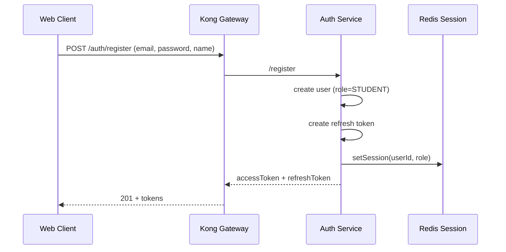
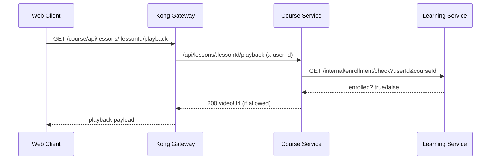
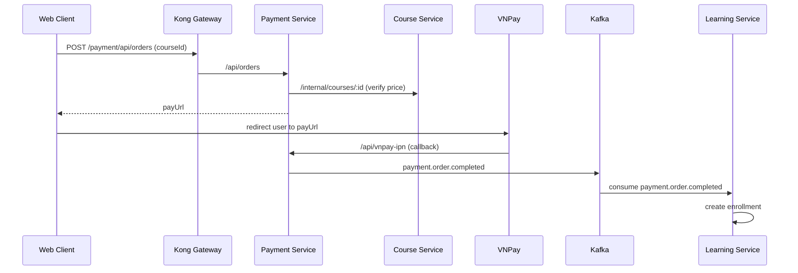
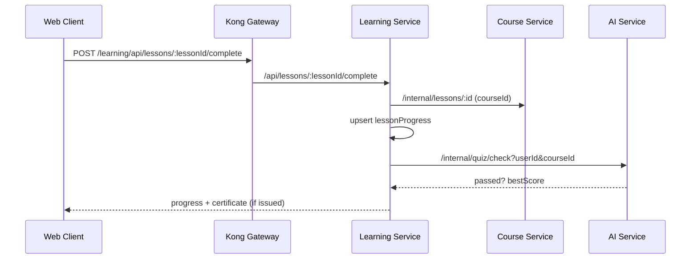
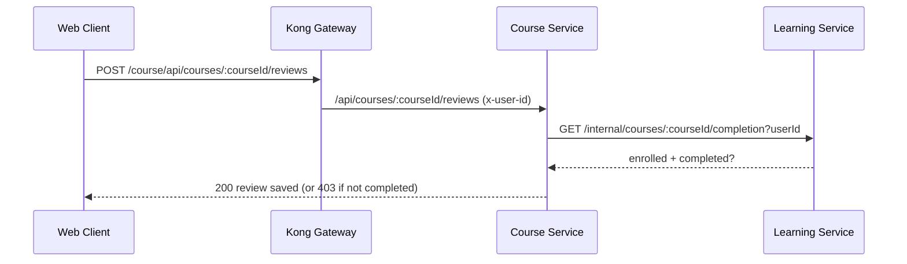

# Student Functions and Flows

This document describes STUDENT-facing features: what each action sends, which services are called, and the end-to-end flow. All requests go through Kong Gateway unless noted.

## Conventions

- Gateway prefixes (default):
  - Auth: /auth
  - Course: /course
  - Learning: /learning
  - Payment: /payment
  - Community: /community
- Auth context is injected by Kong as headers: x-user-id, x-user-role, x-trace-id.
- Next.js Server Actions (BFF) live in [apps/web-client/src/app/actions/student.ts](apps/web-client/src/app/actions/student.ts).

## 1) Authentication (register, login, refresh, logout)

### Register (role auto = STUDENT)
- Client -> /auth/register
- Auth-service creates user with role STUDENT, generates JWT pair, stores refresh token and session in Redis.

Flow:

### Login
- Client -> /auth/login
- Auth-service validates credentials, creates refresh token, stores session in Redis.

### Refresh token
- Client -> /auth/refresh
- Auth-service rotates refresh token, issues new access token.

### Logout
- Client -> /auth/logout
- Auth-service verifies access token, deletes refresh tokens + Redis session.

## 2) Course discovery (browse and detail)

### List courses
- Client -> /course/api/courses
- Course-service returns only PUBLISHED courses with filters (q, category, rating, price, level, sort, page).

### Course detail
- Client -> /course/api/courses/:slug
- Course-service returns course, chapters, lessons (published only). Paid lesson videoUrl is hidden until playback API is called.

### Lesson playback (video access gate)
- Client -> /course/api/lessons/:lessonId/playback
- If lesson is free: returns videoUrl
- If lesson is paid: require login and enrollment (checked via learning-service internal API)

Flow:

## 3) Enrollments

### Free course enroll
- Client (Server Action) -> /learning/api/courses/:courseId/enroll
- Learning-service validates course PUBLISHED and price=0, creates enrollment, writes outbox event.

### Paid course enroll
- Client creates order -> /payment/api/orders
- Payment-service fetches course price from course-service to prevent tampering.
- VNPay redirect -> payment confirmation (IPN)
- Payment-service publishes Kafka event payment.order.completed
- Learning-service (consumer) creates enrollment from event.

Flow:

## 4) Learning and progress tracking

### Get learning data for a course
- Client -> /learning/api/learn/:courseId
- Learning-service checks enrollment and returns chapters, lessons, progress per lesson.

### Get course progress
- Client -> /learning/api/courses/:courseId/progress
- Returns per-lesson progress list (lastWatched, isCompleted).

### Update lesson progress (partial)
- Client (Server Action) -> /learning/api/lessons/:lessonId/progress
- Stores lastWatched seconds (idempotent upsert).

### Complete lesson (and issue certificate if eligible)
- Client -> /learning/api/lessons/:lessonId/complete
- Marks lesson completed, then checks course completion.
- If 100% complete, learning-service calls AI service to verify final quiz before issuing certificate.

Flow:

## 5) Certificates

- List my certificates: GET /learning/api/certificates
- View certificate detail: GET /learning/api/certificates/:certificateNumber
  - Must be owner (same userId)

## 6) Course reviews (after completion)

### List public reviews
- GET /course/api/courses/:courseId/reviews

### My review
- GET /course/api/courses/:courseId/reviews/me (requires auth)

### Create review (one-time, only after 100% completion)
- POST /course/api/courses/:courseId/reviews
- Course-service calls learning-service internal completion API before accepting.

Flow:

## 7) Orders and payment status

- Create order: POST /payment/api/orders
- Continue payment (regenerate payUrl if needed): POST /payment/api/orders/:id/continue
- List my orders: GET /payment/api/orders/my
- Get order detail: GET /payment/api/orders/:id

## 8) Community feed (global)

All require auth.

- List posts: GET /community/api/community/posts?limit=20&cursor=...
- Create post: POST /community/api/community/posts
- Comment on post: POST /community/api/community/posts/:postId/comments
- Like/unlike: POST /community/api/community/posts/:postId/react
- Edit post/comment: PUT /community/api/community/posts/:postId (owner or admin)
- Delete post/comment: DELETE /community/api/community/posts/:postId (owner or admin)

## 9) Q&A (course-specific)

All require auth and enrollment checks.

- List questions: GET /community/api/qa/questions (filters: courseId, lessonId, status, sortBy)
- Create question: POST /community/api/qa/questions (must be enrolled)
- View question detail: GET /community/api/qa/questions/:id (gated by enrollment/instructor/admin)
- Answer question: POST /community/api/qa/questions/:id/answers (instructor/admin only)
- Upvote question/answer, accept answer, update/delete (see qa.routes for details)

## 10) Become instructor (student upgrade paths)

### Direct upgrade (self-service)
- POST /auth/become-educator
- Auth-service validates current role = STUDENT, upgrades role to INSTRUCTOR and returns new access token.

### Instructor request (manual review)
- POST /auth/instructor-requests
- Stores profile and notifies admins; later approval changes role (admin flow).

## 11) Student dashboard aggregation

Dashboard screens fetch data from multiple services in parallel through BFF actions:
- Enrollments + progress: /learning/api/my-enrollments
- Certificates: /learning/api/certificates
- Orders: /payment/api/orders/my
- Profile: /auth/users/:id (via auth-service, not shown here)

See Server Actions in [apps/web-client/src/app/actions/student.ts](apps/web-client/src/app/actions/student.ts) for the exact client-side calls used by the student UI.
