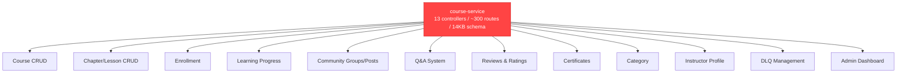
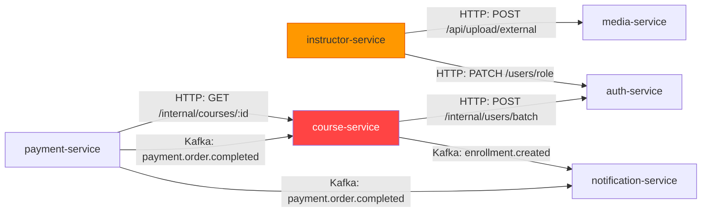
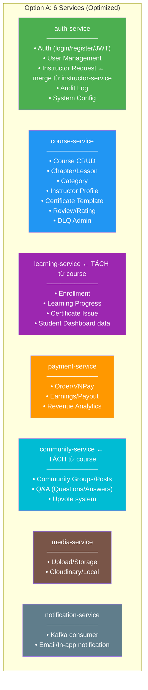

# Phân Tích Kiến Trúc Microservice — LMS Platform

## 1. Tổng Quan Hiện Tại

Hệ thống đang có **6 services**:

| # | Service | Port | DB | Mô tả chính | Số Controllers |
|---|---------|------|-----|-------------|----------------|
| 1 | `auth-service` | 3101 | `auth_db` | Login, Register, JWT, Session Redis, User CRUD, Admin, Audit | 10 |
| 2 | `course-service` | 3002 | `course_db` | **Tất cả** logic LMS: Course, Chapter, Lesson, Enrollment, Progress, Learning, Community, Q&A, Review, Certificate, Category, Instructor Profile, DLQ, Admin | **13** |
| 3 | `instructor-service` | — | riêng (`instructor_db`) | Chỉ quản lý đơn đăng ký giảng viên (InstructorRequest) | **1** |
| 4 | `payment-service` | 3003 | `payment_db` | Order, VNPay, Earnings, Payout | 4 |
| 5 | `media-service` | 3004 | `media_db` | Upload file, Cloudinary/Local storage | 2 |
| 6 | `notification-service` | 3005 | `notification_db` | Kafka consumer → Notification + Email | 1 |

---

## 2. Đánh Giá Theo Nguyên Tắc Microservice

### 2.1 Single Responsibility Principle (SRP)

> [!CAUTION]
> **`course-service` vi phạm nghiêm trọng SRP — đang là "God Service".**

`course-service` hiện đảm nhận **ít nhất 8 bounded context** trong cùng 1 service:



**Vấn đề cụ thể:**
- File `index.ts` có **297 dòng** chỉ để khai báo routes
- Schema Prisma có **413 dòng** với **20 models** khác nhau
- File `course.controller.ts` nặng **50KB** (!)
- File `community.controller.ts` nặng **39KB**

> [!WARNING]
> **`instructor-service` quá mỏng — chỉ có 1 model duy nhất.**

`instructor-service` chỉ quản lý đơn đăng ký giảng viên (`InstructorRequest`), với:
- 1 file controller, 1 file service, 1 model Prisma
- DB riêng chỉ cho **1 bảng duy nhất** → lãng phí connection pool + overhead vận hành

### 2.2 Bounded Context (DDD)

| Bounded Context | Nên thuộc Service nào | **Hiện thuộc** | Đánh giá |
|---|---|---|---|
| Auth, User, Session | auth-service | auth-service | ✅ Đúng |
| Course Catalog (CRUD) | course-service | course-service | ✅ Đúng |
| Enrollment + Learning Progress | **learning-service** | course-service | ❌ Sai context |
| Community + Q&A | **community-service** | course-service | ❌ Sai context |
| Review + Rating | course-service hoặc riêng | course-service | ⚠️ Chấp nhận được |
| Certificate | course-service hoặc riêng | course-service | ⚠️ Chấp nhận được |
| Instructor Profile | auth hoặc course | course-service | ⚠️ Mập mờ |
| Instructor Request (đơn ĐK) | auth-service | instructor-service | ❌ Lãng phí service |
| Payment, Order, VNPay | payment-service | payment-service | ✅ Đúng |
| Earnings, Payout | payment-service | payment-service | ✅ Đúng |
| Media, Upload | media-service | media-service | ✅ Đúng |
| Notification, Email | notification-service | notification-service | ✅ Đúng |

### 2.3 Database-per-Service

| Nguyên tắc | Hiện trạng | Đánh giá |
|---|---|---|
| Mỗi service sở hữu DB riêng | ✅ 5 DB trên Neon | Tuân thủ |
| Không truy cập DB chéo service | ✅ Dùng Internal API / Kafka | Tuân thủ |
| DB chỉ chứa data thuộc domain | ❌ `course_db` chứa 20 models 8 domain | **Vi phạm** |
| `instructor_db` chỉ có 1 bảng | ❌ Lãng phí | **Không hợp lý** |

### 2.4 API Gateway Compliance

> [!WARNING]
> **`instructor-service` vi phạm quy tắc "Services do NOT re-verify token".**

```typescript
// instructor-service/src/middlewares/verifyToken.ts
// File này tuy đã được refactor để đọc x-user-id header từ Kong,
// nhưng VẪN import jwt và VẪN có tên "verifyToken" — gây nhầm lẫn.
// Ngoài ra service dùng `errorResponse/successResponse` riêng,
// KHÔNG dùng ApiResponse<T> chuẩn từ @lms/types.
```

**Các service khác:** Đều trust Kong headers — ✅ tuân thủ.

### 2.5 Coupling Analysis



**Vấn đề coupling:**
1. `instructor-service` gọi trực tiếp `auth-service` để đổi role → **synchronous coupling** cho flow quan trọng
2. `instructor-service` gọi `media-service` để upload file → service-to-service HTTP không qua Gateway

---

## 3. Điểm Mạnh Hiện Tại ✅

| Khía cạnh | Chi tiết |
|---|---|
| **Event-Driven** | Kafka cho payment→enrollment, enrollment→notification — đúng pattern |
| **Retry + DLQ** | Có retry policy + Dead Letter Queue + Admin DLQ API |
| **Idempotency** | Enrollment unique constraint, Notification eventId upsert |
| **Graceful Shutdown** | Tất cả service đều có `shutdown()` handler |
| **ApiResponse<T>** | Chuẩn hóa response format (trừ instructor-service) |
| **Shared Packages** | `@lms/types`, `@lms/logger`, `@lms/kafka-client`, `@lms/cache`, `@lms/env-validator` |
| **Internal API** | `/internal/*` routes cho service-to-service — đúng pattern |

---

## 4. Đề Xuất Tái Cấu Trúc

### Option A: Giữ 6 Service — Tái Phân Bổ Domain (Khuyến Nghị)

> [!TIP]
> **Phù hợp nhất cho scope dự án hiện tại** — giảm số service cần quản lý, giữ đúng bounded context.



Thực ra option A **tăng lên 7 services** (thêm `learning-service` + `community-service`, xóa `instructor-service`).

#### Thay đổi cụ thể:

| Hành động | Chi tiết | Impact |
|---|---|---|
| **Xóa `instructor-service`** | Merge model `InstructorRequest` vào `auth_db`, merge controller vào `auth-service` | Giảm 1 service + 1 DB |
| **Tách `learning-service`** | Lấy Enrollment, LessonProgress, Certificate, Learning controller ra khỏi course-service | DB mới `learning_db` hoặc dùng chung `course_db` (shared schema) |
| **Tách `community-service`** | Lấy Community*, Question, Answer, Upvote ra | DB mới `community_db` hoặc dùng chung `course_db` |
| **Course-service** gọn lại | Chỉ còn Course/Chapter/Lesson/Category/Review/InstructorProfile/CertificateTemplate | Dễ maintain, SRP |

#### DB Strategy:

```
auth_db       → auth-service (+ InstructorRequest)
course_db     → course-service (Course, Chapter, Lesson, Category, Review, InstructorProfile, CertificateTemplate)
learning_db   → learning-service (Enrollment, LessonProgress, Certificate, FailedEvent)
community_db  → community-service (CommunityGroup, CommunityPost, Question, Answer, Upvote)
payment_db    → payment-service
media_db      → media-service
notification_db → notification-service
```

---

### Option B: Giữ Nguyên 6 Service — Chỉ Merge `instructor-service` (Minimal Change)

> Nếu không muốn tách thêm service, ít nhất merge `instructor-service` vào `auth-service`.

| Hành động | Lý do |
|---|---|
| Merge `instructor-service` → `auth-service` | InstructorRequest là subdomain của User Management |
| Giữ nguyên course-service (God Service) | Chấp nhận trade-off, tổ chức lại theo folder nội bộ |

```
services/course-service/src/
├── modules/
│   ├── course/          # Course CRUD, Chapter, Lesson
│   ├── enrollment/      # Enrollment, Free enroll
│   ├── learning/        # Progress, Certificate
│   ├── community/       # Groups, Posts
│   ├── qa/              # Questions, Answers
│   ├── review/          # Reviews
│   ├── instructor/      # InstructorProfile
│   ├── category/        # Categories
│   └── admin/           # DLQ, Admin ops
```

---

## 5. So Sánh 2 Options

| Tiêu chí | Option A (7 services) | Option B (5 services) |
|---|---|---|
| **SRP Compliance** | ✅ Tốt — mỗi service 1-2 bounded context | ⚠️ Trung bình — course-service vẫn lớn |
| **Independent Deploy** | ✅ Tốt — community thay đổi không ảnh hưởng course | ❌ Deploy cả God Service khi sửa community |
| **Scaling** | ✅ Scale learning riêng, community riêng | ❌ Scale cả course khi chỉ cần scale learning |
| **Complexity vận hành** | ⚠️ 7 services + 7 DB | ✅ 5 services + 5 DB |
| **Effort refactor** | 🔴 Cao — tách DB, tách Kafka, tách routes | 🟢 Thấp — chỉ merge 1 service |
| **Team size fit** | Phù hợp 3-5 dev | Phù hợp 1-2 dev |
| **Phù hợp dự án học kỳ** | ⚠️ Over-engineering nếu chỉ 1-2 người | ✅ Vừa đủ |

---

## 6. Khuyến Nghị Cuối

> [!IMPORTANT]
> **Với dự án học kỳ (1-2 dev), chọn Option B + folder restructure là hợp lý nhất.**
> 
> Nếu hướng tới production scale hoặc muốn demonstrate "chuẩn microservice" cho đồ án, chọn Option A.

### Hành động tối thiểu (BẤT KỂ chọn option nào):

1. **[P0] Merge `instructor-service` → `auth-service`** — loại bỏ service chỉ có 1 model
2. **[P0] Xóa `verifyToken.ts` duplicate** — instructor-service vi phạm Gateway trust
3. **[P0] Thống nhất response format** — instructor-service dùng riêng `errorResponse/successResponse`
4. **[P1] Tổ chức lại folder `course-service`** theo module pattern (dù không tách service)
5. **[P1] Tách `community.controller.ts` (39KB) và `course.controller.ts` (50KB)** — quá lớn cho 1 file
6. **[P2] Chuẩn hóa instructor-service approve flow** — chuyển sync HTTP sang Kafka event

---

## 7. Kết Luận

| Câu hỏi | Trả lời |
|---|---|
| Cách chia service có phù hợp không? | **Chưa hoàn toàn** — `course-service` quá tải, `instructor-service` quá mỏng |
| Có chuẩn microservice chưa? | **70-80%** — Event-driven, DB-per-service, API Gateway đều đúng; nhưng SRP và bounded context chưa tốt |
| Cần chia lại không? | **Ít nhất merge instructor vào auth**, tốt nhất tách thêm learning + community |
